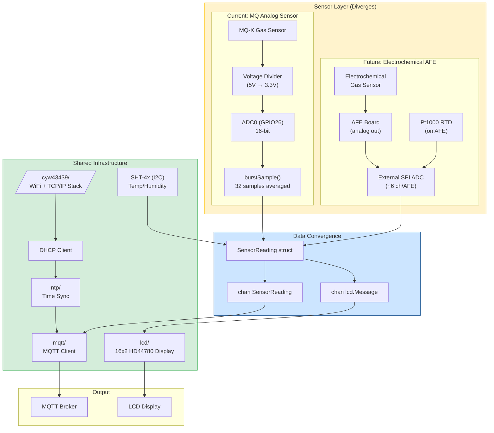
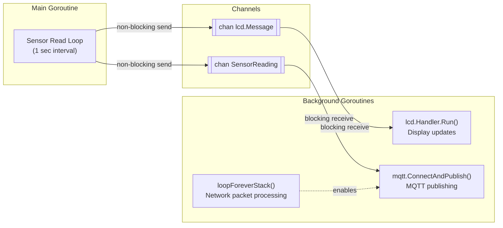

# mqttsensor Architecture

This document describes the system architecture of the mqttsensor project, highlighting shared infrastructure components and the sensor abstraction layer that allows swapping between different sensor types.

## Reading Guide

- **Green boxes**: Shared infrastructure (unchanged regardless of sensor type)
- **Orange boxes**: Sensor-specific components (gas sensor differs per version)
- **Blue boxes**: Data structures and channels (convergence points)
- **Arrows**: Data flow direction

---

## Main Architecture Diagram



---

## Data Flow Diagram

Shows the goroutine-based architecture and channel communication:



---

## Component Breakdown

| Component | Package | Pin/Interface | Shared? | Notes |
|-----------|---------|---------------|---------|-------|
| WiFi/TCP Stack | `cyw43439/` | SPI (internal) | Yes | CYW43439 chip on Pico W |
| DHCP Client | `cyw43439/` | - | Yes | Part of network stack |
| NTP Time Sync | `ntp/` | UDP | Yes | Uses pool.ntp.org |
| MQTT Client | `mqtt/` | TCP | Yes | natiu-mqtt library |
| LCD Display | `lcd/` | I2C0 (GP4/GP5) | Yes | HD44780 16x2 via PCF8574 |
| SHT-4x Weather | `weather/` | I2C | Yes | Temp/humidity for all versions |
| **MQ Sensor** | `main.go` | ADC0 (GPIO26) | **No** | Analog gas sensor |
| **Electrochemical AFE** | TBD | SPI (ext ADC) | **No** | AFE analog → SPI ADC |

---

## Pin Assignments

```
Pico W GPIO Layout (relevant pins)
──────────────────────────────────
GP4    → I2C0 SDA (LCD display)
GP5    → I2C0 SCL (LCD display)
GPIO21 → Debug LED
GPIO22 → Button (input pullup)
I2C    → SHT-4x (temp/humidity, shared by all versions)

MQ Analog Version:
  GPIO26 → ADC0 (MQ sensor input)

Electrochemical AFE Version:
  SPI    → External ADC for AFE channels
           - Pt1000+/- (temperature compensation)
           - WE/AUX per sensor slot (~6 ch total)
```

---

## SensorReading Struct

> **Note:** This struct is pre-alpha. The API will change.

The convergence point where all sensor data flows through:

```go
type SensorReading struct {
    Voltage     float32       // ADC voltage (0-3.3V)
    RawUInt16   uint16        // Raw 16-bit ADC value
    Temperature float32       // SHT-4x temperature
    Humidity    float32       // SHT-4x relative humidity %
    SinceBootNS time.Duration // Uptime
    Timestamp   time.Time     // NTP-synced wall clock
}
```

When swapping to electrochemical sensors, this struct would be extended or a new field added for the calibrated gas concentration (ppm).

---

## Swapping Sensor Types

### What Stays the Same
- All networking (`cyw43439/`, `ntp/`, `mqtt/`)
- Display system (`lcd/`)
- Channel-based architecture
- Main loop structure

### What Changes

| Aspect | MQ Analog | Electrochemical AFE |
|--------|-----------|---------------------|
| Gas sensor interface | Voltage divider → ADC0 | AFE → external SPI ADC |
| ADC | Built-in (3 ch) | External SPI (~6 ch/AFE) |
| Temp compensation | Usually ignored | Pt1000 RTD on AFE |
| Driver code | `burstSample()` in main.go | New `echem/` package |
| Calibration | Voltage-to-ppm curves | Offset → sensitivity → temp comp |
| Power | 5V heater + 3.3V signal | Typically 3.3V only |
| Warm-up | 24-48 hours | Minutes |

### Migration Path

1. Add external SPI ADC driver (new package)
2. Create `echem/` package for AFE signal processing
3. Implement channel reading: Pt1000, WE/AUX per slot
4. Implement calibration pipeline: offset → sensitivity → temp comp
5. Implement `Read() SensorReading` interface
6. Shared infrastructure (WiFi, MQTT, LCD, NTP, SHT-4x) remains untouched
