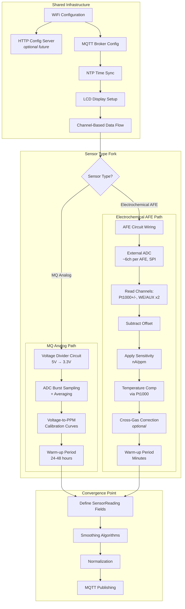

# Build Paths: Sensor System Development Workflow

This document outlines the development task paths for building sensor systems, showing shared infrastructure vs sensor-specific work.

## High-Level Workflow

## Task Breakdown

### Shared Infrastructure (All Sensor Types)

| Task | Current Implementation | Notes |
|------|----------------------|-------|
| WiFi Configuration | Flash-time linker flags | Credentials set at compile time |
| HTTP Config Server | Not implemented | Future: web-based settings page |
| MQTT Broker Config | Flash-time linker flags | Broker URL, topic prefix |
| NTP Time Sync | lwIP SNTP | Timestamps for readings |
| LCD Display | HD44780 via I2C | Real-time sensor values |
| Channel Architecture | Go channels | Decoupled producer/consumer |

### Sensor-Specific: MQ Analog Path

| Task | Details |
|------|---------|
| **Hardware** | Voltage divider circuit (5V heater → 3.3V ADC safe) |
| **Software** | ADC burst sampling with averaging to reduce noise |
| **Calibration** | Sensor-specific voltage-to-ppm curves (datasheet + tuning) |
| **Warm-up** | 24-48 hour burn-in for stable readings |

### Sensor-Specific: Electrochemical AFE Path

| Task | Details |
|------|---------|
| **Hardware** | AFE circuit wiring + external ADC |
| **External ADC** | ~6 channels per AFE, SPI interface to MCU |
| **Channel Mapping** | Pt1000+, Pt1000- (temp), WE/AUX per sensor slot |
| **Offset Subtraction** | Remove baseline offset voltage |
| **Sensitivity** | Apply nA/ppm conversion factor (from datasheet) |
| **Temp Compensation** | Use Pt1000 RTD reading for drift correction |
| **Cross-Gas Correction** | Optional: compensate for interfering gases |
| **Warm-up** | Minutes (per datasheet) |

### Convergence Point (Both Paths)

| Task | Notes |
|------|-------|
| `SensorReading` struct | Fields depend on sensor type (ppm, ppb, raw voltage, etc.) |
| Smoothing algorithms | Moving average, exponential smoothing (sensor-dependent tuning) |
| Normalization | Convert to standard units if needed |
| MQTT Publishing | JSON payload → broker |

## Key Differences Summary

| Aspect | MQ Analog | Electrochemical AFE |
|--------|-----------|---------------------|
| Interface | Built-in ADC | External SPI ADC (~6ch/AFE) |
| Voltage handling | Requires divider (5V→3.3V) | AFE handles signal conditioning |
| Signal processing | Voltage → calibration curve → ppm | ADC → offset → sensitivity → temp comp → ppm |
| Calibration | Manual voltage-to-ppm curves | Datasheet sensitivity + offset values |
| Temp compensation | Usually ignored | Required (Pt1000 RTD) |
| Cross-gas | N/A | Optional correction for interferents |
| Warm-up time | 24-48 hours | Minutes |
| Cost | Lower | Higher |
| Accuracy | Moderate | Higher |
